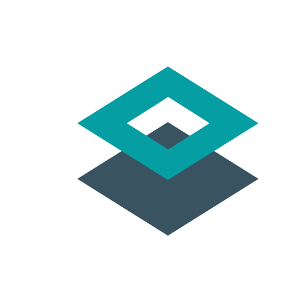
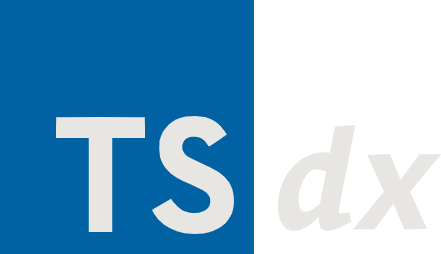
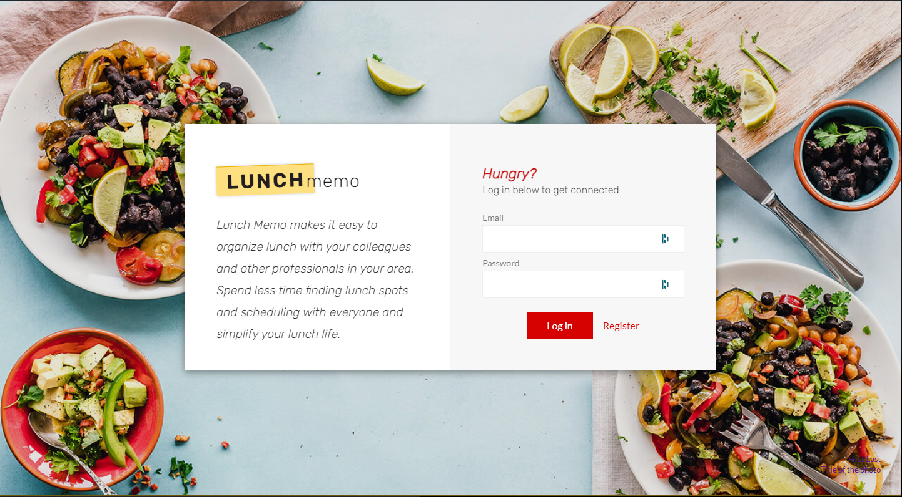
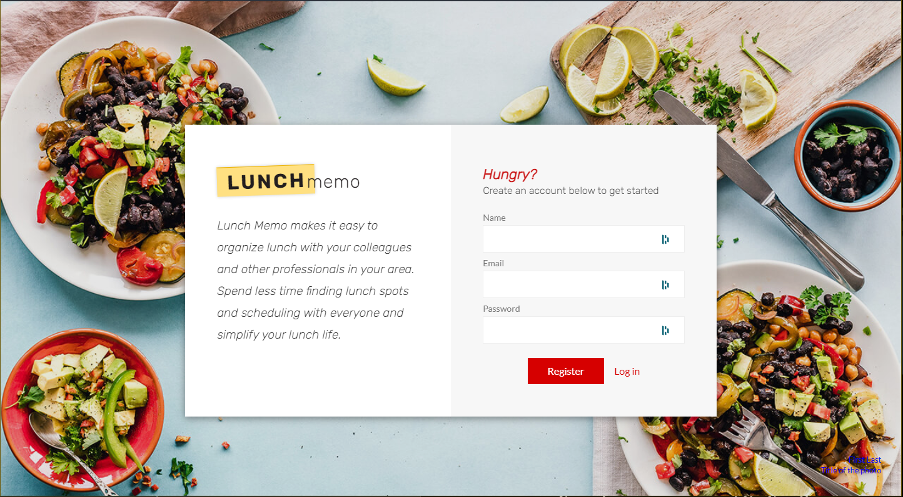
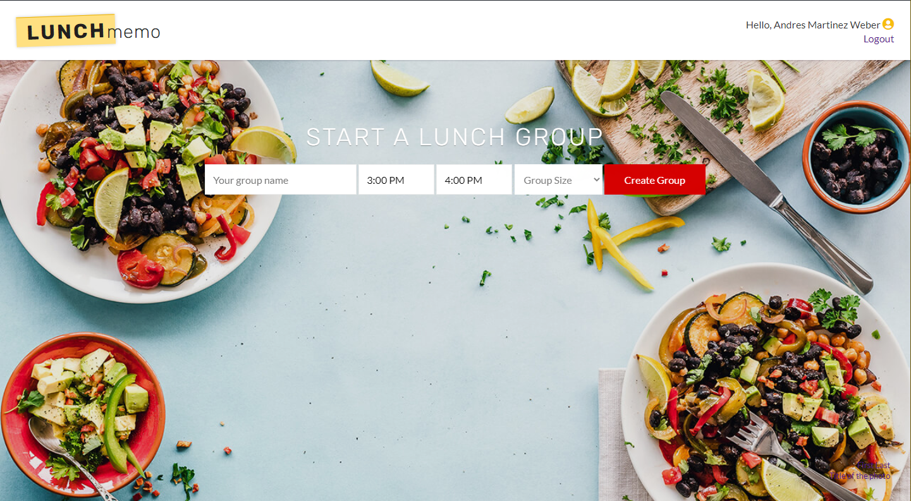
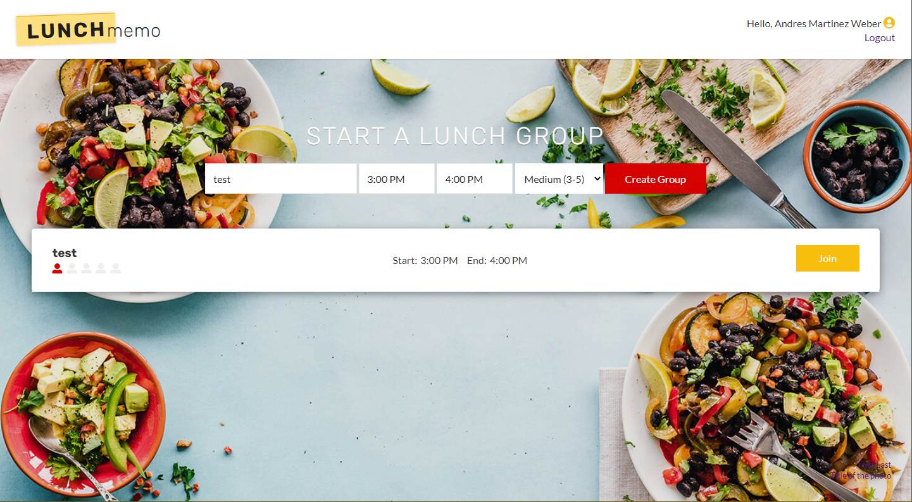

<h1 align=center>
    
     
    LunchMemo
     
    
    
    
    
    
    
</h1>

 Lunch Memo makes it easy to
    organize lunch with your colleagues and other professionals in your area. Spend less time finding lunch spots
    and scheduling with everyone and simply your lunch life with LunchMemo.

<h3 align="center">
    <code>
    <a href="https://lunchmemo.andresmweber.com/" target="_blank">Live Demo</a>
    ·
    <a href="#installation">Installation</a>
    </code>
</h3>

## 📝 Table of Contents

- [Tech Stack](#tech)
- [Screenshots](#screens)
- [Setup](#setup)
- [Deployment](#deployment)
- [Built Using](#built_using)
- [Authors](#authors)
- [Contributors](#contributors)

# 🔩 Tech Stack 

    
    
    
    
    
    

# 🎞️ Screenshots 

    
    
    
    

# 🔧 Setup 

### Installation

#### Local Development

- Clone the [repo]('https://github.com/Banda-Media/LunchMemo')
- Install the server dependencies with: `npm install` or `yarn install`
- Run the local server using `npm run dev` or `yarn dev`
- Open `http://localhost:3000` and Have fun!

---

### Environment Variables

#### Set up API Access

- Obtain a [Yelp API Key](https://www.yelp.com/developers/documentation/v3/authentication)
- Create a [Firebase Project](https://firebase.google.com)
- (Optional): Create a [NextJS Vercel project](https://vercel.com/) and install the Github App
- (Optional): Create a [FeaturePeek project](https://featurepeek.com/) and install the Github App
- Set the following environment variables on | [mac](https://stackoverflow.com/questions/7501678/set-environment-variables-on-mac-os-x-lion) | [windows](https://superuser.com/questions/1334129/setting-an-environment-variable-in-windows-10-gpodder) | [linux](https://stackoverflow.com/questions/45502996/how-to-set-environment-variable-in-linux-permanently) |
- Copy `.env example` and set entries for environment config

| Key                                           | Description                                         |
| :-------------------------------------------- | --------------------------------------------------- |
| `NEXT_PUBLIC_LM_YELP_API_KEY`                 | The generated Yelp Fusion API key you created       |
| `NEXT_PUBLIC_LM_FIREBASE_API_KEY`             | Firebase API Key                                    |
| `NEXT_PUBLIC_LM_FIREBASE_AUTH_DOMAIN`         | Firebase Project Config Var                         |
| `NEXT_PUBLIC_LM_FIREBASE_PROJECT_ID`          | Firebase Project Config Var                         |
| `NEXT_PUBLIC_LM_FIREBASE_DATABASE_URL`        | Firebase Project Config Var                         |
| `NEXT_PUBLIC_LM_FIREBASE_STORAGE_BUCKET`      | Firebase Project Config Var                         |
| `NEXT_PUBLIC_LM_FIREBASE_MESSAGING_SENDER_ID` | Firebase Project Config Var                         |
| `NEXT_PUBLIC_LM_FIREBASE_APP_ID`              | Firebase Project Config Var                         |
| `NEXT_PUBLIC_LM_FIREBASE_MEASUREMENT_ID`      | Firebase Project Config Var                         |
| `NEXT_PUBLIC_LM_FIREBASE_CLIENT_EMAIL`        | Firebase Admin Project Config Var                   |
| `NEXT_PUBLIC_LM_FIREBASE_PRIVATE_KEY`         | Firebase Admin Project Config Var                   |
| `NEXT_PUBLIC_LM_SECURE_COOKIE`                | LunchMemo auth config (boolean, should be false)    |
| `DEBUG`                                       | (Optional) Debugger filter, default is lunchmemo:\* |

---

# ✍️ Authors 

# 🤝 Contributors 

